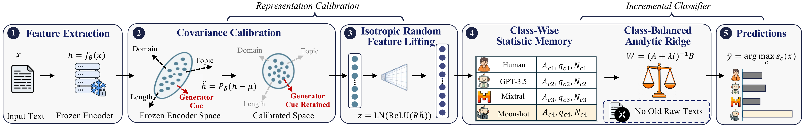

# RidgeFT

Official implementation of our **EMNLP 2026 Main Conference** paper:

> **When New Generators Arrive: Lifelong Machine-Generated Text Attribution via Ridge Feature Transfer**

RidgeFT is an exemplar-free framework for lifelong machine-generated text
attribution. It keeps the encoder frozen after the initial stage and adds new
generator classes through analytical updates.



## Repository contents

```text
RidgeFT-Lifelong-MGT/
├── ridgeft/
│   ├── __init__.py              # Public package API
│   ├── model.py                 # End-to-end RidgeFT interface
│   ├── spectral.py              # Covariance calibration
│   ├── random_features.py       # Fixed random feature lifting
│   ├── classifier.py            # Class-balanced analytic ridge classifier
│   └── utils.py                 # Numerical utilities
├── examples/
│   ├── minimal_demo.py          # Small synthetic example
│   └── run_mgt_academic.py      # MGT-Academic example
├── tests/test_smoke.py          # API smoke checks
├── assets/ridgeft-framework.png # Method overview from the paper
├── pyproject.toml               # Package metadata
├── requirements.txt             # Dependencies for the real-data example
└── LICENSE                      # MIT License
```

## Quick start

```bash
git clone https://github.com/Vincent-HKUSTGZ/RidgeFT-Lifelong-MGT.git
cd RidgeFT-Lifelong-MGT
pip install -e .
python examples/minimal_demo.py
```

The real-data example uses an MGT-Academic-style dataset layout and requires
the additional packages listed in `requirements.txt`.

## License

RidgeFT is released under the [MIT License](LICENSE).

<sub>This repository was organized with Codex. If you encounter a problem, please open a GitHub issue.</sub>

## Citation

If you use RidgeFT in your research, please cite our paper:

```bibtex
@inproceedings{SLHWHYH26,
author = {Zhen Sun and Yifan Liao and Zhicong Huang and Jiaheng Wei and Cheng Hong and Yutao Yue and \textbf{Xinlei He}},
title = {{When New Generators Arrive: Lifelong Machine-Generated Text Attribution via Ridge Feature Transfer}},
booktitle = {{Conference on Empirical Methods in Natural Language Processing (EMNLP)}},
publisher = {ACL},
year = {2026}
}
```
